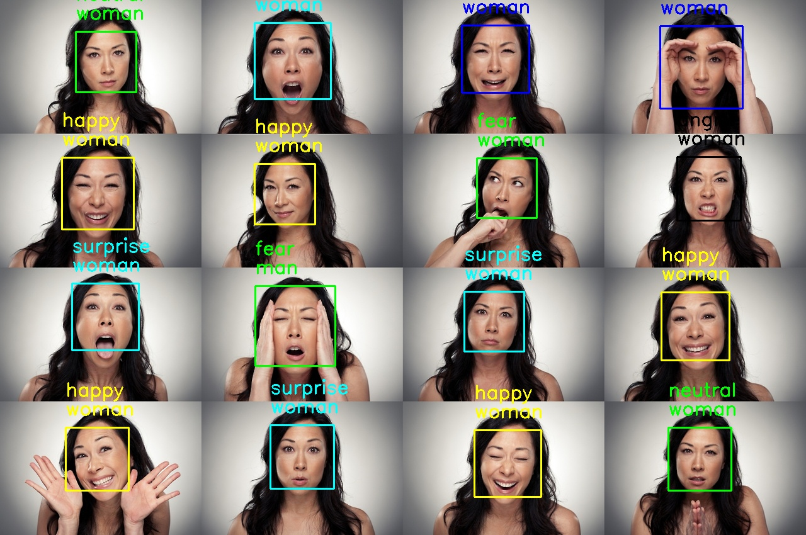

# Duygu Tanıma-Emotion Recognition
### Google Colab Notebook Demo_1: Duygu Tanıma / Emotion Recogniton
Colab.Research üzerinden Pyhton2-3 ile GPU üzerinde çalıştırabileceğiniz Duygu Tanıma uygulaması.
https://drive.google.com/file/d/1GMxVqRJiF7CNr9rpt2LHKAVP-fLS4WgH/view?usp=sharing

# Duygu ve Cinsiyet Tanıma-Emotion and Gender Recognition
### Google Colab Notebook Demo_2: Duygu ve Cinsiyet Tanıma / Emotion and Gender Recogniton
Colab.Research üzerinden Pyhton2-3 ile GPU üzerinde çalıştırabileceğiniz Duygu ve Cinsiyet Tanıma uygulaması.
https://drive.google.com/file/d/1SsEeJ6CH79j1b1RQ3E2IhWvZFydRtiGz/view?usp=sharing

